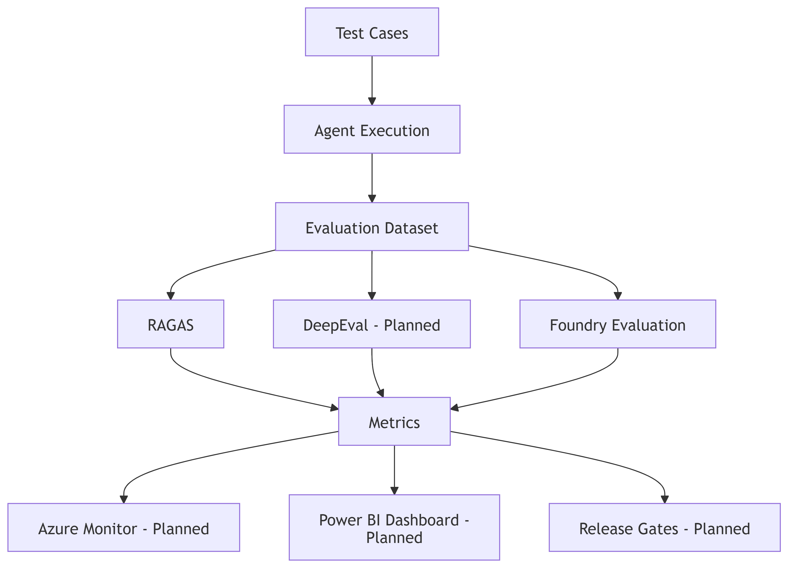
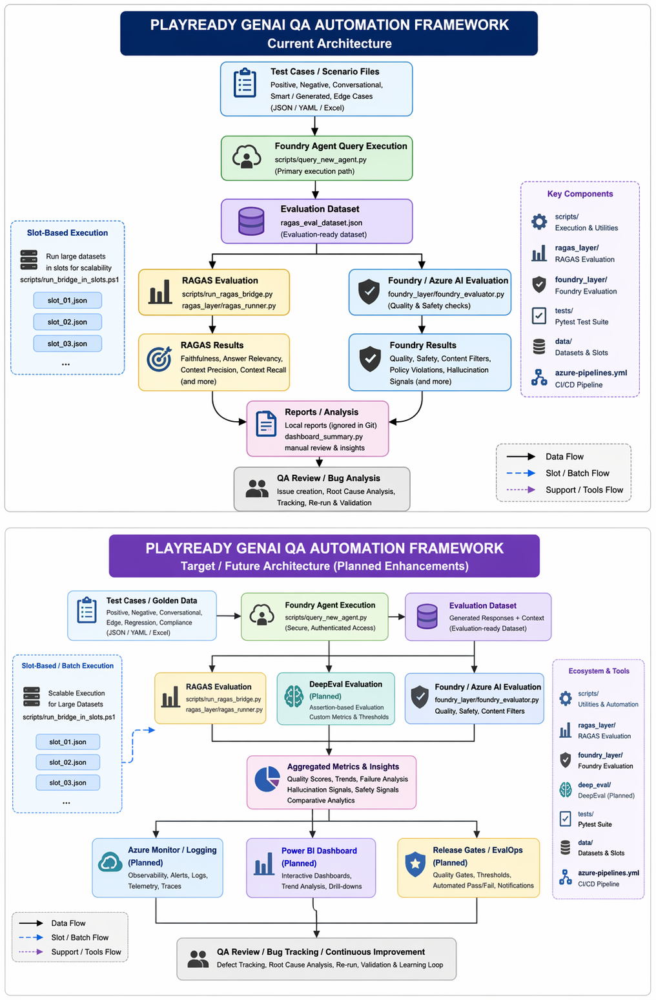

 FINAL CLEAN README (READY TO PASTE ✅)
👉 Replace your README completely with THIS 👇

Markdown# 🚀 PlayReady GenAI QA Automation Framework## 📌 OverviewThis repository implements a **GenAI QA Automation framework** for validating a **PlayReady Foundry-based RAG chatbot**.The framework automates:- Agent query execution- Evaluation dataset generation- Quality assessment using RAGAS & Foundry evaluation- Scalable test execution> ⚠️ This reflects the **current implementation**. DeepEval, dashboards, and observability are planned enhancements.---## 🎯 Objectives- Validate responses for correctness, relevance, grounding- Detect hallucinations and edge-case failures- Enable large-scale automated testing- Support reproducible QA workflows- Build foundation for **EvalOps-style GenAI testing**---## ✅ Current Capabilities### 🔹 Foundry Agent Execution```bashpython scripts/query_new_agent.pyShow less

Calls real Foundry agent
Generates evaluation-ready dataset


🔹 RAGAS Evaluation
Shellpython scripts/run_ragas_bridge.pyShow more lines
Metrics:

Faithfulness
Answer Relevancy
Context Precision
Context Recall


🔹 Foundry Evaluation Layer

foundry_layer/foundry_evaluator.py
tests/test_foundry_eval.py

Supports additional evaluation signals.

🔹 Multi-Suite Testing
Covers:

Negative scenarios
Conversational flows
Edge cases
Compliance / data safety


🔹 Slot-Based Execution (Scalable)
Shellpowershell scripts/run_bridge_in_slots.ps1Show more lines

Prevents timeouts
Enables batch processing


🔹 CI/CD Ready

azure-pipelines.yml
reproducible QA workflows

## 🧠 Architecture (Current)



```mermaid
flowchart TD
    A[Test Cases] --> B[query_new_agent.py]
    B --> C[Evaluation Dataset]
    C --> D[RAGAS Evaluation]
    C --> E[Foundry Evaluation]
    D --> F[RAGAS Results]
    E --> G[Foundry Results]
    F --> H[Reports / Analysis]
    G --> H
    H --> I[QA Review / Bug Analysis]

## 🔮 Future Architecture



```mermaid
flowchart TD
    A[Test Cases] --> B[Agent Execution]
    B --> C[Evaluation Dataset]
    C --> D[RAGAS]
    C --> E[DeepEval - Planned]
    C --> F[Foundry Evaluation]
    D --> G[Metrics]
    E --> G
    F --> G
    G --> H[Azure Monitor - Planned]
    G --> I[Power BI Dashboard - Planned]
    G --> J[Release Gates - Planned]


📂 Project Structure
playready-qa-automation/
│
├── scripts/              
├── tests/                
├── data/                 
├── ragas_layer/          
├── foundry_layer/        
├── audit/                
│
├── azure-pipelines.yml   
├── requirements.txt      
├── .gitignore            
└── README.md


🚀 Setup & Run
1. Setup
Shellpython -m venv .venv.venv\Scripts\activatepip install -r requirements.txtShow more lines

2. Azure Login
Shellaz loginShow more lines

3. Run Agent
Shellpython scripts/query_new_agent.pyShow more lines

4. Evaluate
Shellpython scripts/run_ragas_bridge.pyShow more lines

5. Run Tests
Shellpytest -vShow more lines

⚠️ Current Limitations

DeepEval not fully integrated
No centralized dashboard
Observability not yet implemented
Some analysis is manual


🔥 Roadmap

DeepEval integration
Power BI dashboards
Azure Monitor logging
Automated regression detection
Full EvalOps pipeline


🎯 Why This Project Matters
This framework enables:

repeatable QA
metric-driven evaluation
scalable testing
clean enterprise workflows


👨‍💻 Author
Sushrut Nistane
QA Automation Engineer – GenAI / RAG Systems

---

✅ ✅ FINAL PUSH

```powershell
git add docs/
git add README.md
git commit -m "📊 Add real architecture diagrams + Mermaid"
git push
